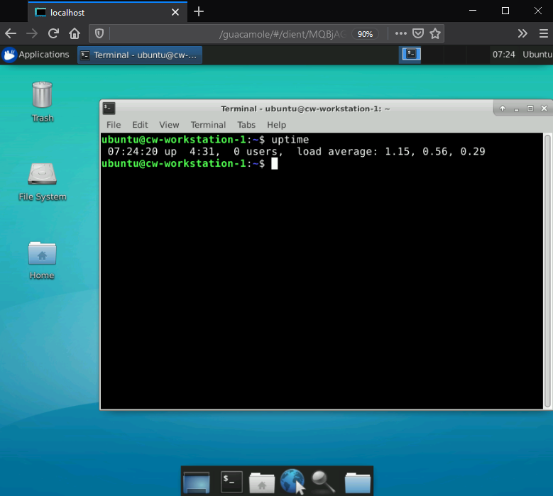

# Reference
A browser-based linux desktop workstation in AWS. Built with Apache Guacamole and Ubuntu using Terraform and Ansible.

# Requirements
- Terraform installed.
- AWS credentials (e.g. `aws configure` if awscli is installed)
- Customized variables (see Variables section).

# Variables
Edit the vars file (.tfvars) to customize the deployment, especially:

**bucket_name**

- a unique bucket name, terraform will create the bucket to store various resources.

**mgmt_cidr**

- an IP range granted webUI and EC2 SSH access.
- deploying from home? This should be your public IP address with a /32 suffix. 

**kms_manager**

- an AWS user account (not root) that will be granted access to the KMS key (to read S3 objects).

- Don't have an IAM user? Replace all occurrences of `${data.aws_iam_user.cw-kmsmanager.arn}` with a role ARN (e.g. an Instance Profile ARN), and remove the `aws_iam_user` block in cw-generic.tf.

**instance_key**

- a public SSH key for SSH access to instances via user `ubuntu`.

**instance_vol_size**

- the volume/filesystem size of the workstation disk, in GiB.

# Deploy
```
# Initialize terraform
terraform init

# Apply terraform - the first apply takes a while creating an encrypted AMI.
terraform apply -var-file="cw.tfvars"

# Wait for SSM to run the Ansible Playbook (workstation/), watch:
https://console.aws.amazon.com/systems-manager/state-manager
```

# Sample Guacamole Configuration
- Connect via SSH with user `ubuntu` and set a password via `passwd`.
- Browse to https://<instance_public_ip>/guacamole
- Authenticate with default user:pass guacadmin:guacadmin, **change the password**.
- Click guacadmin (top right) -> Connections -> New Connection
  - Name: localhost
  - Protocol: RDP
  - Guacamole Proxy Parameters (guacd container)
    - Hostname: 192.168.11.2
    - Port: 4822
  - Parameters (guacd to localhost)
    - Hostname: 172.17.0.1
    - Port: 3389
    - Username: ubuntu
    - Password: <some password>
    - Ignore server certificate: True

# Screenshots
Configuration:


Session:



# AMI Notes
- AMI is [Ubuntu 1804](https://cloud-images.ubuntu.com/locator/ec2/), change the vendor_ami_name_string var as needed (especially the date).
- AMI is assumed to have SSM installed, if not - install via user_data.
