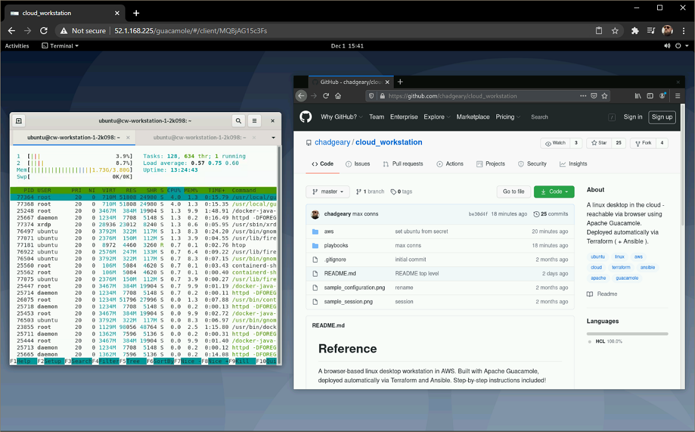
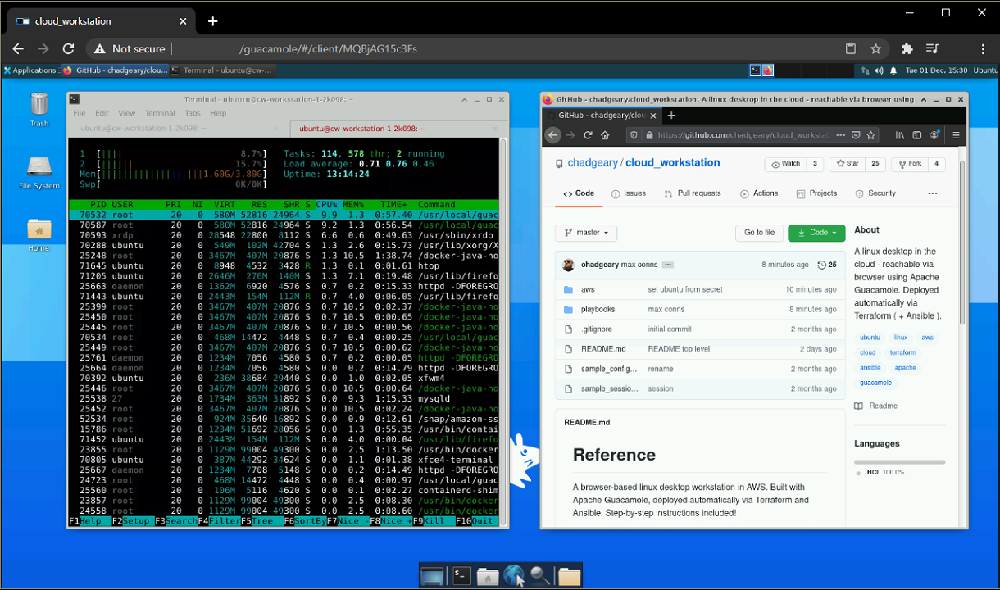

# Reference
A browser-based linux desktop workstation in AWS. Built with Apache Guacamole, deployed automatically via Terraform and Ansible. Step-by-step instructions included! Desktops supported include gnome and XFCE:

# Instructions
See the sub-directory of each cloud provider for specific instructions, including Windows users.

# Discussion
[Discord Room](https://discord.gg/vG3UKd2RRn)
